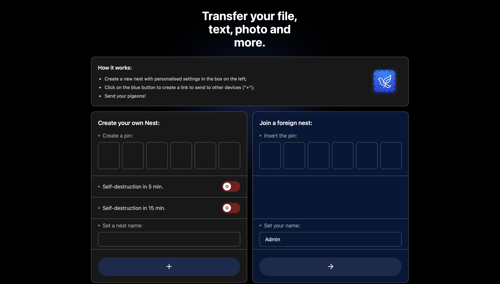
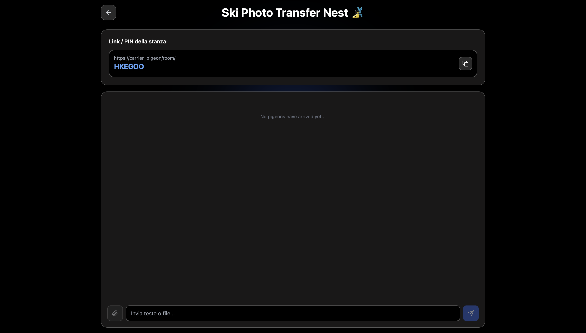
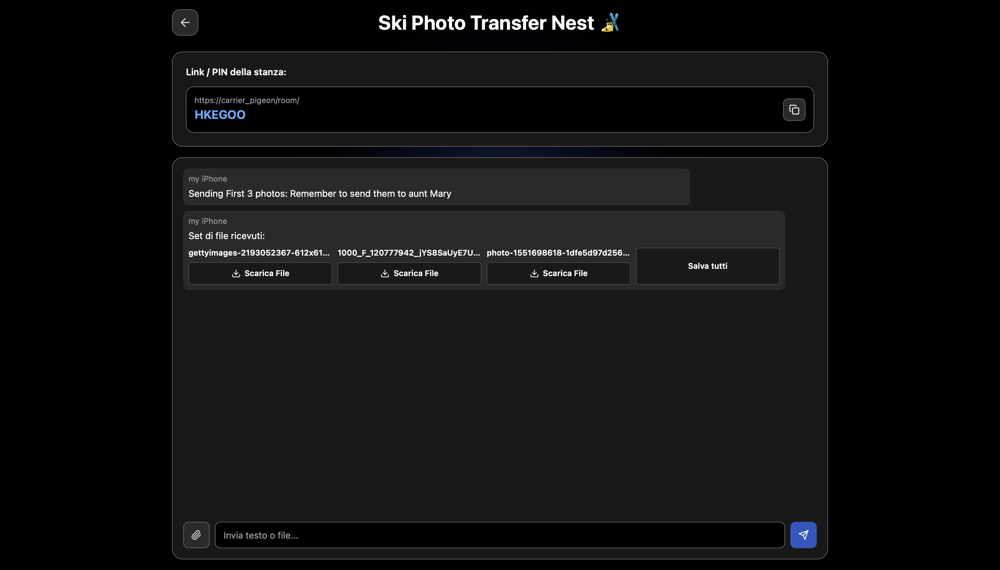
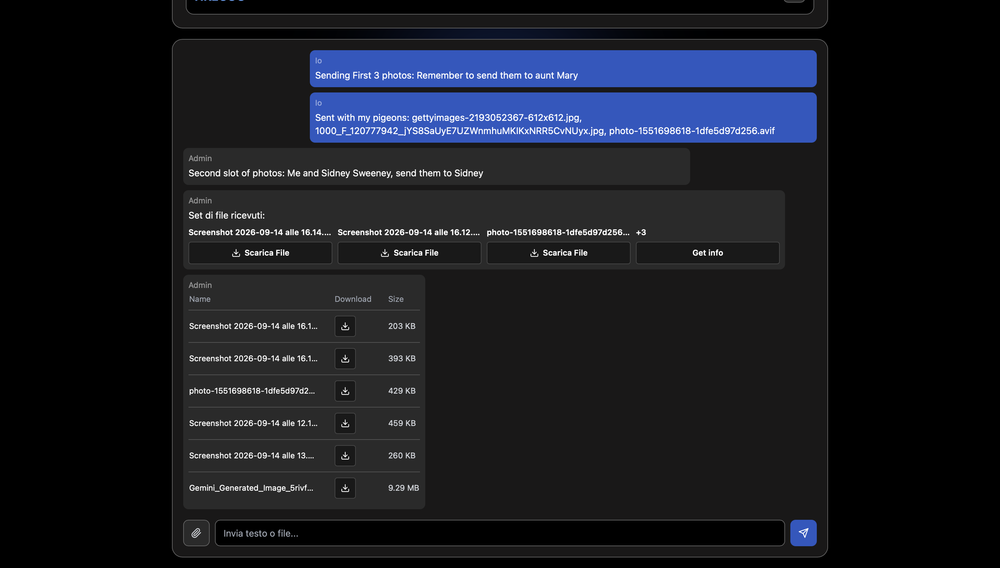

# Carrier Pigeon v1.0

### Description
Carrier Pigeon is a Progressive Web App (PWA) designed for the seamless 
and secure transfer of files of any size across multiple devices.

The core vision behind this project was to build a platform that guarantees 
secure file sharing without relying on an intermediary server to handle the data. 
By leveraging direct Peer-to-Peer (P2P) connections, this approach offers two massive advantages: 
it drastically reduces server hosting costs and ensures unparalleled user privacy, as your files 
never pass through or rest on a third-party server.

However, Carrier Pigeon is more than just a file-sharing tool. 
It introduces the concept of "Nests"—private, secure rooms tailored for 
exchanging sensitive information, messages, and important documents. 
To maximize confidentiality, every Nest comes with a self-destruction feature, 
automatically erasing the room and its contents after a predefined period of time.

### How to use it
**0. In locale**. _Con Visual Studio Code._

E' sufficiente entrare nella cartella frontend da terminale e scrivere: `npm install` e poi  `npm run dev`

Poi aprire un altro terminale, andare nella cartella backend e scrivere:`npm install` e poi `node server.js`.

Fatto questo, sarà possibile vedere il link condivisibile da tutti i device, purché connessi alla stessa rete.

**1. In locale**. _Usando l'app Automator del Mac_

In questo modo potrai usare Carrier Pigeon quando vuoi in modo molto rapido: ti basterà cliccare sull'app creata con automator.

Per farlo, apri Automator e crea un "Nuovo documento", poi "Applicazione", poi "Esegui Apple Script", 
cancelli lo script che trovi lì, e incolli questo script (ATTENZIONE! modifica il percorso in base a dove hai salvato la cartella).

```
on run {input, parameters}
    
    tell application "Terminal"
        activate
        -- Apre una finestra per il backend e avvia il server
        do script "cd /Users/MODIFY_HERE/carrier_pigeon_v1/backend && node server.js"
        
        -- Apre una SECONDA finestra per il frontend e avvia Vite
        do script "cd /Users/MODIFY_HERE/carrier_pigeon_v1/frontend && npm run dev -- --host"
    end tell
    
    -- Aspetta che entrambi i server siano pronti prima di aprire il browser
    delay 4
    
    -- Apre automaticamente il browser predefinito all'indirizzo dell'app
    do shell script "open http://localhost:5173"
    
    return input
end run
```

**Opzione 2**. _Carica tutto su Render.com e crea gratuitamente un link pubblico e accessibile a chiunque_

In questo modo potrai condividere file da un device all'altro anche se essi sono distanti migliaia di chilometri.


### How to send files
Ti basterà creare una stanza privata dove poterti connettere con i tuoi dispositivi.

Con un device crei la stanza inserendo un PIN personalizzato nel box "Create Nest" (oppure no, verrà scelto in automatico), poi con l'altro device accedi a quella stanza scrivendo nel box "join nest", lo stesso codice che hai ottenuto o scritto prima. 

Non appena il device si sarà connesso anche l'admin potrà inviare i messaggi.

_Alcune immagini_







